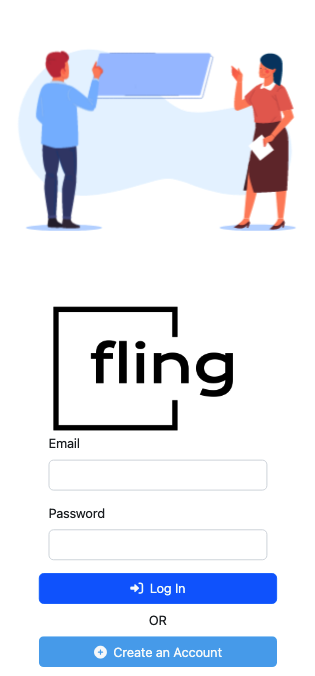

# Fling

## About
Web application project for IS216 (Web Application Develoment II). 

Fling is a chat application for SMU students to network and join ad-hoc events such as hackathons.
Responsive and works on mobile devices.

## Deployment
Built using Vite, Vue, Bootstrap and Google Firebase. [Deployed on Firebase Hosting](https://is216-proj-v1.web.app/).

Pushes to `main` and merged pull requests are automatically deployed to live site.

## Preview Images

    
    
    
    

## To run locally:
Install Node.js/NPM.

In folder root, run `npm install`.

To preview local devopment server:`npm run preview`.

To build and minify for production:`npm run build`.

